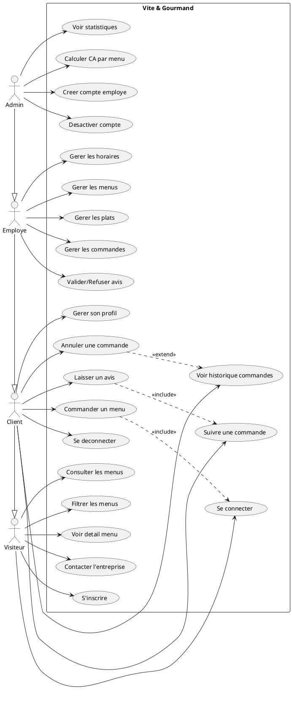

# Diagramme de Cas d'Utilisation

## Vite & Gourmand - Use Cases

### Visualisation
Utilise [Mermaid Live Editor](https://mermaid.live) ou [PlantUML](https://plantuml.com) pour visualiser.

---

## Diagramme Mermaid

```mermaid
flowchart TB
    subgraph Systeme["Systeme Vite & Gourmand"]
        UC1["Consulter les menus"]
        UC2["Filtrer les menus"]
        UC3["Voir detail menu"]
        UC4["Contacter l'entreprise"]
        UC5["S'inscrire"]
        UC6["Se connecter"]
        UC7["Se deconnecter"]
        UC8["Gerer son profil"]
        UC9["Commander un menu"]
        UC10["Voir historique commandes"]
        UC11["Annuler une commande"]
        UC12["Suivre une commande"]
        UC13["Laisser un avis"]
        UC14["Gerer les menus"]
        UC15["Gerer les plats"]
        UC16["Gerer les commandes"]
        UC17["Valider/Refuser avis"]
        UC18["Gerer les horaires"]
        UC19["Creer compte employe"]
        UC20["Desactiver compte"]
        UC21["Voir statistiques"]
        UC22["Calculer CA par menu"]
    end

    Visiteur((Visiteur))
    Client((Client))
    Employe((Employe))
    Admin((Admin))

    %% Visiteur
    Visiteur --> UC1
    Visiteur --> UC2
    Visiteur --> UC3
    Visiteur --> UC4
    Visiteur --> UC5
    Visiteur --> UC6

    %% Client herite de Visiteur
    Client --> UC7
    Client --> UC8
    Client --> UC9
    Client --> UC10
    Client --> UC11
    Client --> UC12
    Client --> UC13

    %% Employe herite de Client
    Employe --> UC14
    Employe --> UC15
    Employe --> UC16
    Employe --> UC17
    Employe --> UC18

    %% Admin herite de Employe
    Admin --> UC19
    Admin --> UC20
    Admin --> UC21
    Admin --> UC22

    %% Relations d'heritage
    Client -.->|herite| Visiteur
    Employe -.->|herite| Client
    Admin -.->|herite| Employe
```

---

## Version PlantUML (alternative)

---

## Description des Acteurs

### Visiteur (non authentifie)
Personne naviguant sur le site sans etre connectee.

**Peut :**
- Consulter la liste des menus
- Filtrer les menus (prix, theme, regime, nb personnes)
- Voir le detail d'un menu
- Utiliser le formulaire de contact
- Creer un compte (inscription)
- Se connecter

### Client (authentifie)
Utilisateur inscrit et connecte avec le role "client".

**Herite des droits du Visiteur, plus :**
- Se deconnecter
- Modifier son profil (nom, adresse, telephone)
- Passer une commande
- Consulter l'historique de ses commandes
- Annuler une commande (si pas encore acceptee)
- Suivre l'etat de ses commandes
- Laisser un avis (apres livraison)

### Employe
Membre de l'equipe Vite & Gourmand avec le role "employe".

**Herite des droits du Client, plus :**
- Creer, modifier, supprimer des menus
- Creer, modifier, supprimer des plats
- Gerer les commandes (changer les statuts)
- Filtrer les commandes par statut ou client
- Valider ou refuser les avis clients
- Modifier les horaires d'ouverture

### Administrateur
Gerant de l'entreprise avec le role "admin".

**Herite des droits de l'Employe, plus :**
- Creer des comptes employes
- Activer/Desactiver des comptes employes
- Visualiser les statistiques (graphiques)
- Calculer le chiffre d'affaires par menu (avec filtres)

---

## Tableau Recapitulatif

| Cas d'utilisation | Visiteur | Client | Employe | Admin |
|-------------------|:--------:|:------:|:-------:|:-----:|
| Consulter menus | X | X | X | X |
| Filtrer menus | X | X | X | X |
| Voir detail menu | X | X | X | X |
| Contacter | X | X | X | X |
| S'inscrire | X | - | - | - |
| Se connecter | X | - | - | - |
| Se deconnecter | - | X | X | X |
| Gerer profil | - | X | X | X |
| Commander | - | X | X | X |
| Historique commandes | - | X | X | X |
| Annuler commande | - | X | X | X |
| Suivre commande | - | X | X | X |
| Laisser avis | - | X | X | X |
| Gerer menus | - | - | X | X |
| Gerer plats | - | - | X | X |
| Gerer commandes | - | - | X | X |
| Valider avis | - | - | X | X |
| Gerer horaires | - | - | X | X |
| Creer employe | - | - | - | X |
| Desactiver compte | - | - | - | X |
| Voir statistiques | - | - | - | X |
| Calculer CA | - | - | - | X |

---

## Relations entre cas d'utilisation

### Include (inclusion obligatoire)
- **Commander un menu** inclut **Se connecter** (authentification requise)
- **Laisser un avis** inclut **Suivre commande** (doit etre livree)

### Extend (extension optionnelle)
- **Annuler commande** etend **Voir historique** (action possible depuis l'historique)

---

## Export en image

### Mermaid
1. Va sur https://mermaid.live
2. Colle le code Mermaid
3. Exporte en PNG

### PlantUML
1. Va sur https://www.plantuml.com/plantuml/uml
2. Colle le code PlantUML
3. Telecharge l'image
