# Diagramme de Classes - Architecture MVC

## Vite & Gourmand - Structure PHP

### Visualisation
Utilise [Mermaid Live Editor](https://mermaid.live) pour visualiser ce diagramme.

```mermaid
classDiagram
    direction TB

    %% ===== CORE =====
    class Router {
        -array routes
        -string controller
        -string method
        -array params
        +__construct()
        +parseUrl() array
        +dispatch() void
    }

    class Controller {
        <<abstract>>
        #view(string view, array data) void
        #redirect(string url) void
        #json(array data, int code) void
        #isPost() bool
        #isAjax() bool
        #getPostData() array
    }

    class Model {
        <<abstract>>
        #PDO db
        #string table
        +__construct()
        #getConnection() PDO
        +findAll() array
        +findById(int id) object
        +create(array data) int
        +update(int id, array data) bool
        +delete(int id) bool
    }

    class Auth {
        <<static>>
        +check() bool
        +user() User
        +id() int
        +isAdmin() bool
        +isEmployee() bool
        +isClient() bool
        +requireAuth() void
        +requireRole(string role) void
        +login(User user) void
        +logout() void
    }

    class Csrf {
        <<static>>
        +generateToken() string
        +getToken() string
        +verifyToken(string token) bool
        +getInputField() string
    }

    %% ===== CONTROLLERS =====
    class HomeController {
        +index() void
        +about() void
    }

    class MenuController {
        +index() void
        +show(int id) void
        +filter() void
    }

    class OrderController {
        +create(int menuId) void
        +store() void
        +history() void
        +show(int id) void
        +cancel(int id) void
    }

    class UserController {
        +register() void
        +login() void
        +logout() void
        +profile() void
        +updateProfile() void
        +forgotPassword() void
        +resetPassword(string token) void
    }

    class AdminController {
        +dashboard() void
        +menus() void
        +menuCreate() void
        +menuEdit(int id) void
        +menuDelete(int id) void
        +orders() void
        +orderShow(int id) void
        +orderUpdateStatus(int id) void
        +reviews() void
        +reviewApprove(int id) void
        +reviewReject(int id) void
        +employees() void
        +employeeCreate() void
        +employeeToggle(int id) void
        +stats() void
    }

    class ContactController {
        +index() void
        +send() void
    }

    class ReviewController {
        +create(int orderId) void
        +store() void
    }

    class ApiController {
        +menus() void
        +menu(int id) void
        +calculatePrice() void
    }

    class CartController {
        +index() void
        +add() void
        +update() void
        +remove(int index) void
        +clear() void
    }

    class PaymentController {
        +checkout() void
        +process() void
        +success() void
        +cancel() void
        +webhook() void
    }

    %% ===== MODELS =====
    class User {
        -int id
        -string firstName
        -string lastName
        -string email
        -string phone
        -string passwordHash
        -string role
        -string address
        -string city
        -string postalCode
        -bool isActive
        -bool emailVerified
        +findByEmail(string email) User
        +verifyPassword(string password) bool
        +validatePassword(string password) array
        +generateVerificationToken() string
        +generateResetToken() string
        +hashPassword(string password) string
    }

    class Menu {
        -int id
        -string title
        -string description
        -string theme
        -string dietaryType
        -int minPeople
        -decimal basePrice
        -decimal pricePerExtra
        -int stock
        -bool isAvailable
        +findAvailable() array
        +findByTheme(string theme) array
        +findByDietaryType(string type) array
        +getDishes() array
        +getImages() array
        +getAllergens() array
        +getAverageRating() float
        +getReviews(bool approvedOnly) array
    }

    class Dish {
        -int id
        -string name
        -string description
        -string category
        -decimal basePrice
        -string imageUrl
        +findByCategory(string cat) array
        +getAllergens() array
    }

    class Allergen {
        -int id
        -string name
        -string icon
        +findAll() array
    }

    class Order {
        -int id
        -string orderNumber
        -int userId
        -int menuId
        -int numberOfPeople
        -decimal totalPrice
        -string status
        +findByUser(int userId) array
        +findByStatus(string status) array
        +findPending() array
        +updateStatus(string status) bool
        +calculatePrice(int menuId, int people, float distance) array
        +generateOrderNumber() string
        +canBeCancelled() bool
        +getMenu() Menu
        +getUser() User
    }

    class Review {
        -int id
        -int userId
        -int orderId
        -int menuId
        -int rating
        -string comment
        -bool isApproved
        +findByMenu(int menuId, bool approved) array
        +findPendingApproval() array
        +approve(int employeeId) bool
        +reject() bool
        +getUser() User
        +getMenu() Menu
    }

    class Statistics {
        -MongoDB connection
        +logOrder(array data) void
        +getOrdersByMenu() array
        +getRevenueByMenu(array filters) array
        +getMonthlyStats() array
        +getDailyOrders(string date) int
    }

    class Cart {
        <<static>>
        -array items
        +init() void
        +add(array item) void
        +update(int index, array data) void
        +remove(int index) void
        +clear() void
        +getItems() array
        +count() int
        +getTotal() float
    }

    class OrderItem {
        -int id
        -int orderId
        -int menuId
        -int numberOfPeople
        -decimal unitPrice
        -decimal totalPrice
        +findByOrder(int orderId) array
        +create(array data) int
    }

    %% ===== SERVICES =====
    class EmailService {
        -string fromEmail
        -string fromName
        +sendWelcome(User user) bool
        +sendOrderConfirmation(Order order) bool
        +sendEmployeeCreated(User employee, string password) bool
        +sendEquipmentReminder(Order order) bool
        +sendReviewInvitation(Order order) bool
        +sendPasswordReset(User user, string token) bool
        -send(string to, string subject, string body) bool
    }

    class ValidationService {
        <<static>>
        +validateEmail(string email) bool
        +validatePhone(string phone) bool
        +validatePassword(string password) array
        +sanitize(string input) string
        +validateRequired(array fields, array data) array
    }

    %% ===== RELATIONS =====
    Controller <|-- HomeController
    Controller <|-- MenuController
    Controller <|-- OrderController
    Controller <|-- UserController
    Controller <|-- AdminController
    Controller <|-- ContactController
    Controller <|-- ReviewController
    Controller <|-- ApiController
    Controller <|-- CartController
    Controller <|-- PaymentController

    Model <|-- User
    Model <|-- Menu
    Model <|-- Dish
    Model <|-- Allergen
    Model <|-- Order
    Model <|-- Review

    Router --> Controller : dispatch
    Controller --> Model : uses
    Controller --> Auth : uses
    Controller --> Csrf : uses
    AdminController --> Statistics : uses
    OrderController --> EmailService : uses
    UserController --> EmailService : uses
    UserController --> ValidationService : uses

    Order --> User : belongsTo
    Order --> Menu : belongsTo
    Review --> User : belongsTo
    Review --> Order : belongsTo
    Review --> Menu : belongsTo
    Menu --> Dish : hasMany
    Dish --> Allergen : hasMany
```



---

## Description des Classes

### Core (Noyau MVC)

#### Router
Gere le routage des URLs vers les controleurs.
- Parse l'URL en segments
- Instancie le bon controleur
- Appelle la methode avec les parametres

#### Controller (Abstract)
Classe de base pour tous les controleurs.
- Gestion des vues
- Redirections
- Reponses JSON
- Detection POST/AJAX

#### Model (Abstract)
Classe de base pour tous les modeles.
- Connexion PDO
- CRUD generique
- Requetes preparees

#### Auth
Gestion de l'authentification (statique).
- Verification connexion
- Gestion des roles
- Protection des routes

#### Csrf
Protection contre les attaques CSRF.
- Generation de tokens
- Verification des tokens

### Controllers

| Controller | Responsabilite |
|------------|----------------|
| HomeController | Pages statiques (accueil, a propos) |
| MenuController | Affichage et filtrage des menus |
| OrderController | Gestion des commandes client |
| UserController | Authentification et profil |
| AdminController | Back-office employe/admin |
| ContactController | Formulaire de contact |
| ReviewController | Gestion des avis |
| ApiController | Endpoints JSON pour AJAX |
| CartController | Gestion du panier multi-menus |
| PaymentController | Integration Stripe, paiement |

### Models

| Model | Table | Description |
|-------|-------|-------------|
| User | users | Utilisateurs (clients, employes, admins) |
| Menu | menus | Menus du traiteur |
| Dish | dishes | Plats individuels |
| Allergen | allergens | Allergenes alimentaires |
| Order | orders | Commandes clients |
| OrderItem | order_items | Articles de commande (panier) |
| Review | reviews | Avis et notes |
| Cart | session | Panier en session (multi-menus) |
| Statistics | MongoDB | Statistiques (NoSQL) |

### Services

| Service | Description |
|---------|-------------|
| EmailService | Envoi d'emails automatiques |
| ValidationService | Validation et sanitization des donnees |

---

## Arborescence des fichiers

```
src/
├── Core/
│   ├── Router.php
│   ├── Controller.php
│   ├── Model.php
│   ├── Auth.php
│   └── Csrf.php
│
├── Controllers/
│   ├── HomeController.php
│   ├── MenuController.php
│   ├── OrderController.php
│   ├── UserController.php
│   ├── AdminController.php
│   ├── ContactController.php
│   ├── ReviewController.php
│   └── ApiController.php
│
├── Models/
│   ├── User.php
│   ├── Menu.php
│   ├── Dish.php
│   ├── Allergen.php
│   ├── Order.php
│   ├── Review.php
│   └── Statistics.php
│
├── Services/
│   ├── EmailService.php
│   └── ValidationService.php
│
└── Views/
    ├── layouts/
    ├── home/
    ├── menu/
    ├── order/
    ├── user/
    ├── admin/
    ├── contact/
    ├── review/
    └── emails/
```

---

## Export en image

1. Va sur https://mermaid.live
2. Colle le code du diagramme
3. Exporte en PNG ou SVG
4. Sauvegarde dans `docs/uml/diagramme-classes.png`
