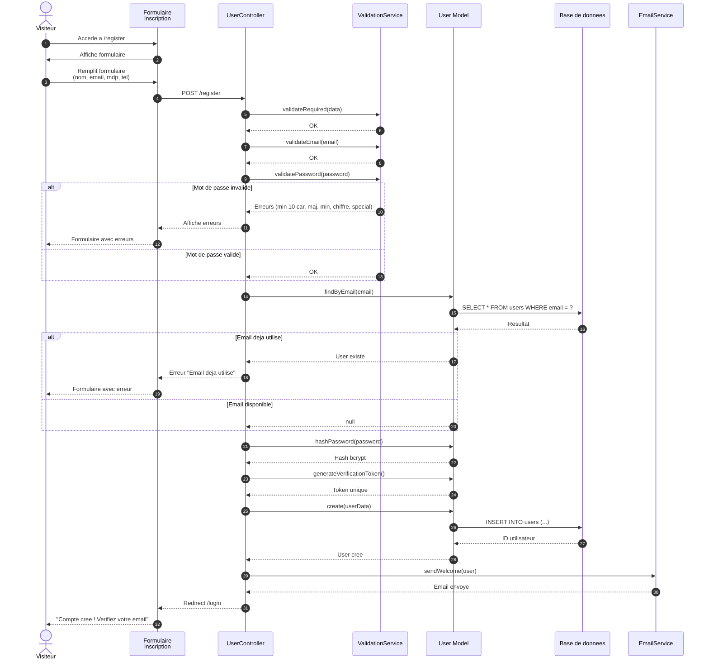
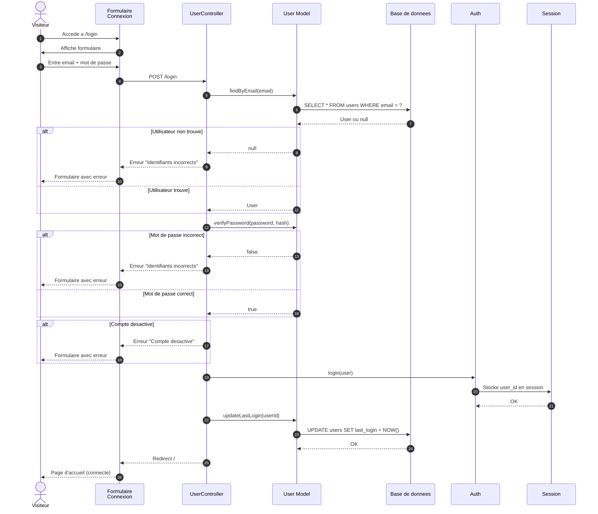
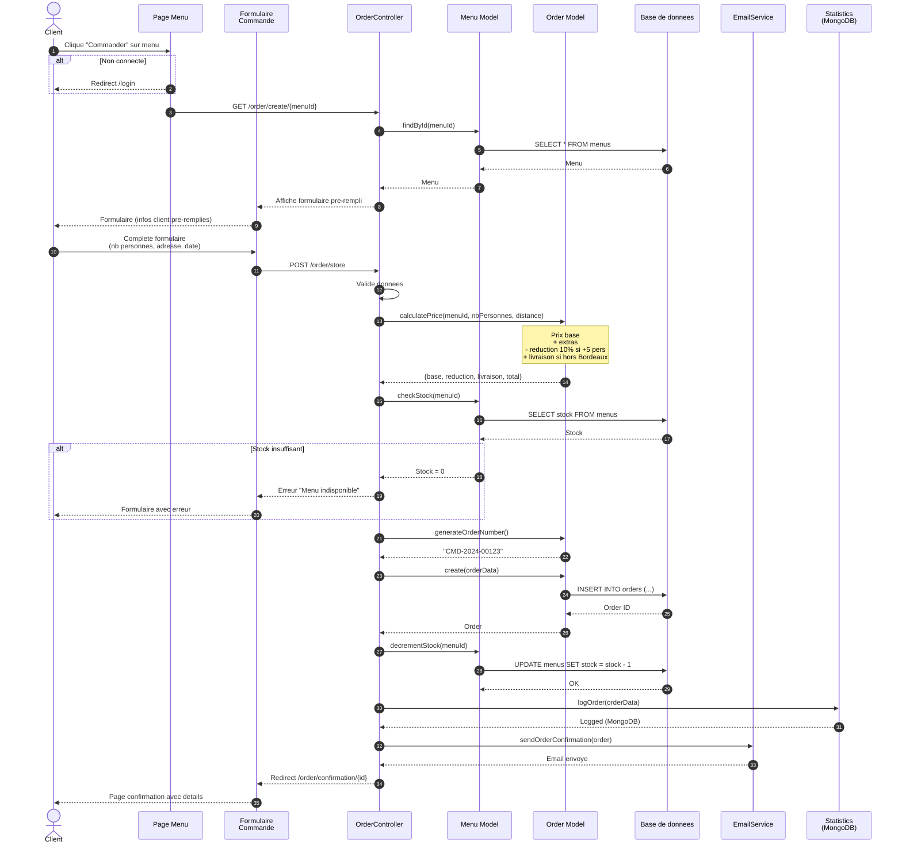
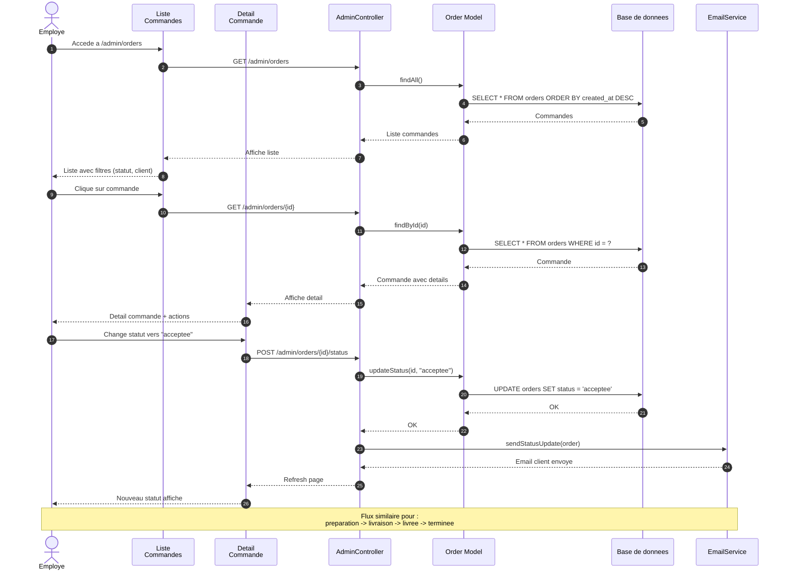
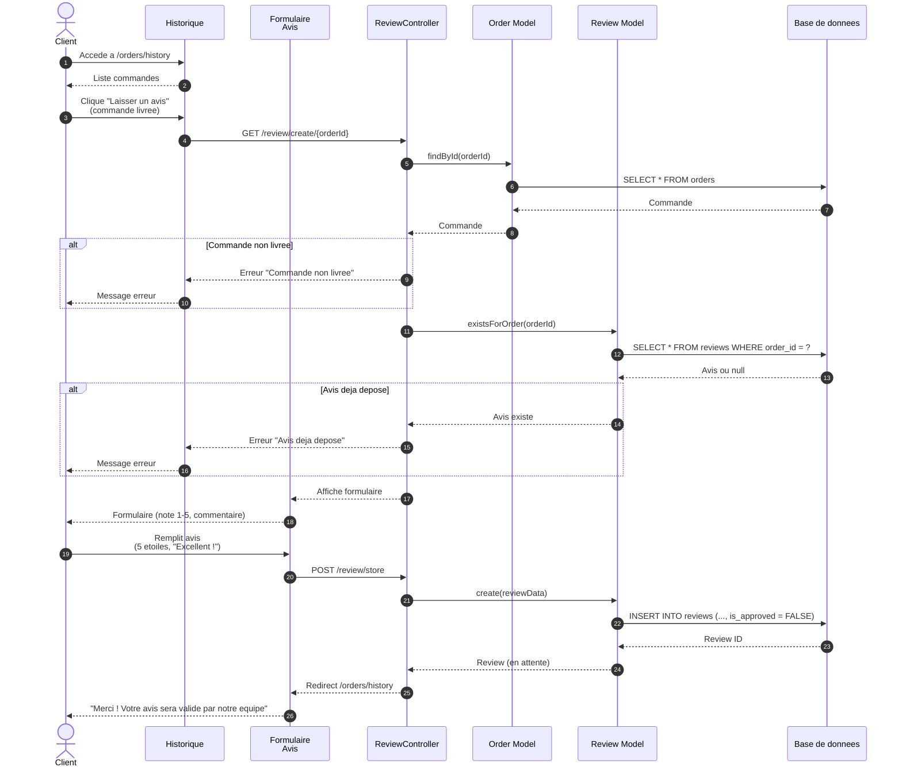
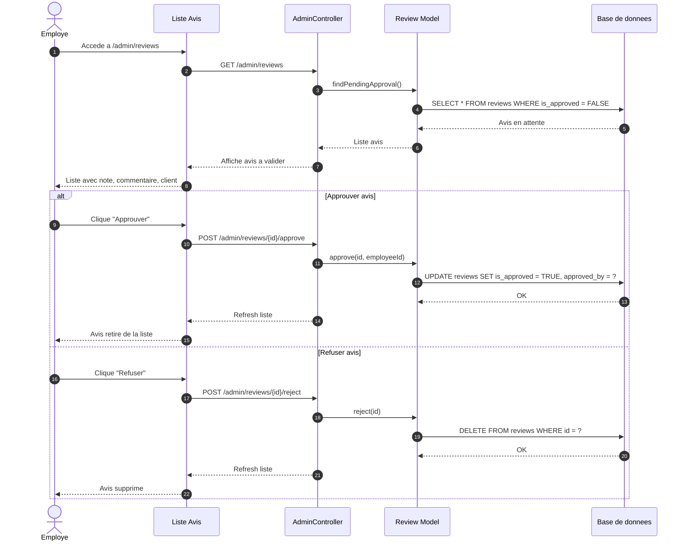
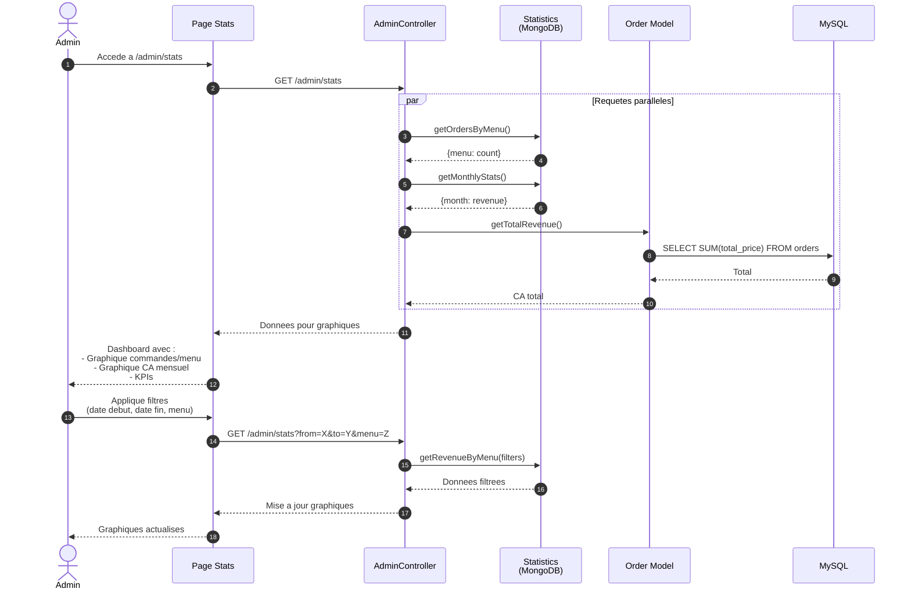

# Diagrammes de Sequence

## Vite & Gourmand - Flux principaux

### Visualisation
Utilise [Mermaid Live Editor](https://mermaid.live) pour visualiser ces diagrammes.

---

## 1. Sequence : Inscription Utilisateur



### Description du flux
1. Le visiteur accede au formulaire d'inscription
2. Il remplit ses informations personnelles
3. Le systeme valide :
   - Champs obligatoires
   - Format email
   - Complexite mot de passe (10 car, maj, min, chiffre, special)
4. Verification que l'email n'est pas deja utilise
5. Hashage du mot de passe avec bcrypt
6. Creation du compte en base
7. Envoi de l'email de bienvenue
8. Redirection vers la page de connexion

---

## 2. Sequence : Connexion Utilisateur



---

## 3. Sequence : Passage de Commande



### Calcul du prix detaille
```
Prix de base (min_personnes)     : 320 EUR
+ Personnes supplementaires      : (nb - min) x prix_extra
= Sous-total                     : XXX EUR
- Reduction 10% (si +5 pers sup) : -XX EUR
+ Frais livraison hors Bordeaux  : 5 EUR + 0.59 EUR/km
= TOTAL                          : XXX EUR
```

---

## 4. Sequence : Gestion Commande (Employe)



### Etats de commande
```
nouvelle ──► acceptee ──► preparation ──► livraison ──► livree ──► terminee
                                                           │
                                                           ▼
                                                    attente_retour
                                                    (si materiel)
```

---

## 5. Sequence : Depot d'Avis



---

## 6. Sequence : Validation Avis (Employe)



---

## 7. Sequence : Consultation Statistiques (Admin)



---

## Export des diagrammes

### Mermaid Live Editor
1. Accede a https://mermaid.live
2. Colle chaque diagramme separement
3. Exporte en PNG ou SVG
4. Nomme les fichiers :
   - `sequence-inscription.png`
   - `sequence-connexion.png`
   - `sequence-commande.png`
   - `sequence-gestion-commande.png`
   - `sequence-avis.png`
   - `sequence-validation-avis.png`
   - `sequence-statistiques.png`
